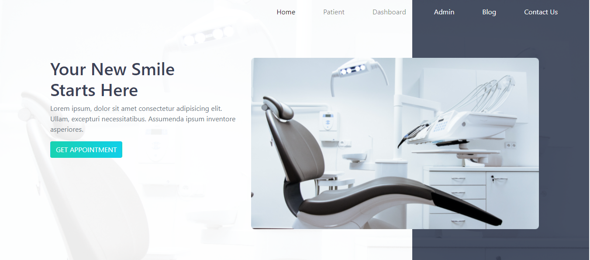

# Doctor Portal

# [Link](https://doctors-portal8.firebaseapp.com/ "Homepage")

A full-stack app where you can pick the date and time and fix an appointment with your doctor. A doctor can review his appointments and prescribe medicine to a patient.

## Features

* This is a service seller full-stack website.
* This site has an admin’s panel, form where an admin can add a service, add an admin.
* A User can Order a service. Also, can take a free consultation here.
* Store User information
* A User can review any service.

## Technology: 

* React 
* React Router
* Bootstrap
* NodeJS
* ExpressJS
* MongoDB
* Heroku
* Firebase
* Chrome Dev Tools